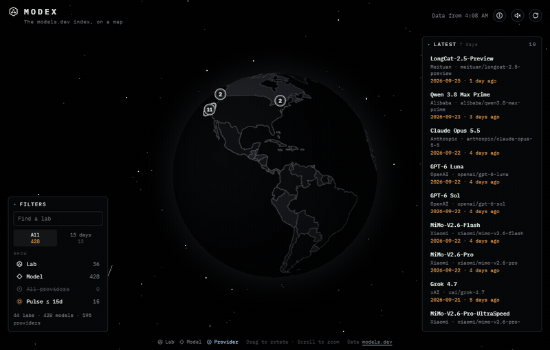
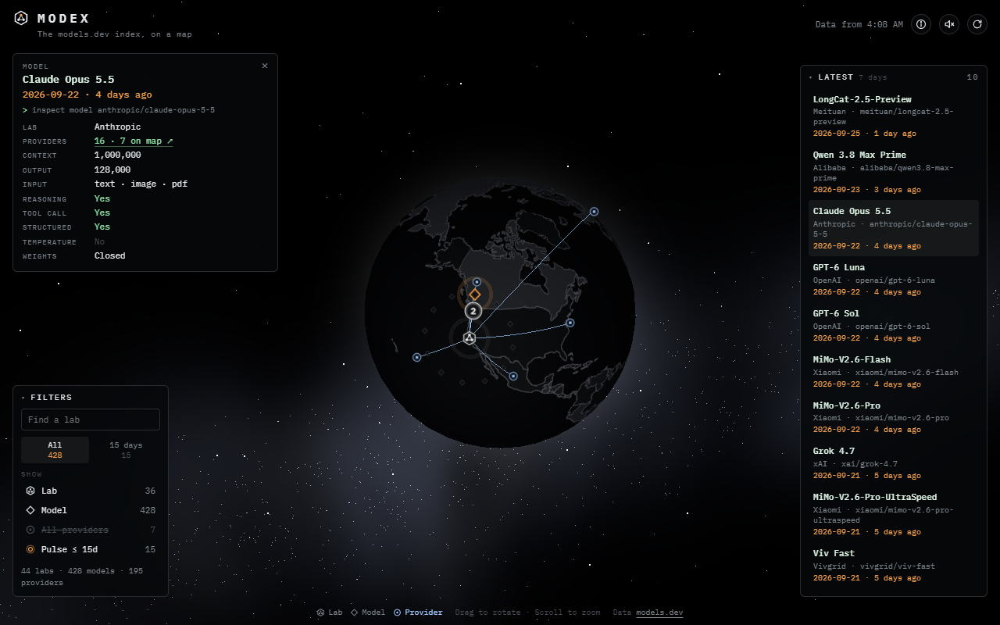
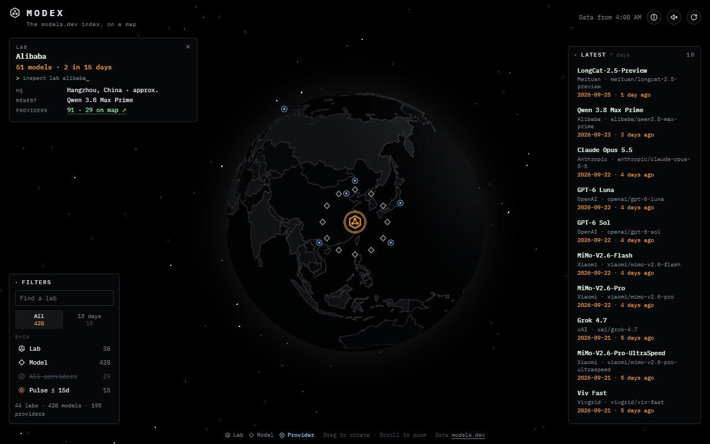
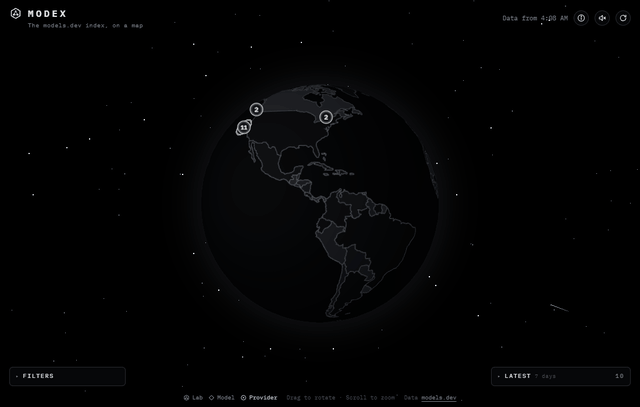
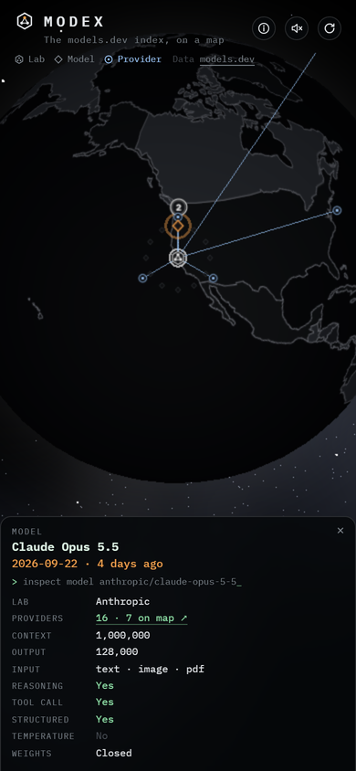

# Modex

**The [models.dev](https://models.dev) index, on a map.**



Modex puts the AI model world on a globe. Every AI lab sits where it's based. Click one and its models fan out around it. Pick a model and you'll see arcs reaching out to every provider that serves it, from the lab's own API to cloud platforms and gateways around the world.

It's a small, fast way to answer questions like *"who actually serves this model?"* or *"what did this lab release lately?"*, without reading through a catalog.

## What you can do

- **Explore labs.** Dozens of labs, most pinned at their approximate headquarters. Nearby ones group into a numbered badge; click it to fan them out.
- **See the models.** Select a lab to see its newest models ring around it. The card shows context size, input types, reasoning and tool support, and whether the weights are open.
- **Follow the providers.** Select a model and arcs draw out to the providers that serve it: Amazon Bedrock, Azure, Vertex, OpenRouter, and many more.
- **Catch what's new.** Labs that shipped something in the last 15 days pulse. The Latest panel lists the past week's releases.
- **Filter and search.** Show or hide labs, models, and providers, jump to a lab by name, and switch on sound effects if you like.

It works on phones too, and it remembers the last catalog it loaded, so return visits open instantly (even offline).

## A quick look

<table>
  <tr>
    <td width="50%"></td>
    <td width="50%"></td>
  </tr>
  <tr>
    <td align="center"><sub>Each model card lists specs and how many providers serve it.</sub></td>
    <td align="center"><sub>Pick a lab and its newest models ring around it.</sub></td>
  </tr>
  <tr>
    <td width="50%"></td>
    <td width="50%" align="center"></td>
  </tr>
  <tr>
    <td align="center"><sub>Drag to spin the globe. Nearby labs group into numbered badges.</sub></td>
    <td align="center"><sub>On phones, details open as a bottom sheet.</sub></td>
  </tr>
</table>

## Run it locally

You'll need Node.js 22 (20.19 or newer also works).

```bash
npm install
```
```bash
npm run dev
```

Then open the address Vite prints, usually <http://localhost:5173>. The dev server pulls the catalog live from models.dev.

## Deploy it

Modex builds to a plain folder of static files, so you can host it almost anywhere:

```bash
npm run build
```

Publish the `dist/` folder, and that's it. The build fetches models.dev once and bakes the catalog into `dist/catalog.json`. Rebuild now and then (a scheduled rebuild every 12 hours is included) to pick up new models.

Modex runs on **Cloudflare Pages**. [docs/DEPLOY.md](docs/DEPLOY.md) walks through that setup step by step, plus what to carry over to other hosts.

## Where the data comes from

- **Labs, models, and providers** come from [models.dev](https://models.dev), an open, community-maintained catalog (© 2025 models.dev, MIT License). Modex just reads it and draws it.
- **Locations** aren't part of models.dev. They're approximate headquarters, or a registered business address when no HQ is published, gathered in [`src/places.ts`](src/places.ts).
- **Map outlines** come from Natural Earth, via world-atlas.

Some labs and providers don't have a location yet, so they aren't pinned on the globe (their models still show up everywhere else).

## How it's built

A small Vite + TypeScript app with three.js for the globe. [docs/ARCHITECTURE.md](docs/ARCHITECTURE.md) has the details.

## A note on accuracy

Modex is an independent project. It isn't affiliated with models.dev or with any lab or provider on the map. Locations are approximate, and model details can be incomplete or out of date, so check with the provider before relying on them.

## License

Copyright (C) 2026 aunai-org ([aunai.org](https://aunai.org)).

Modex is free software under the [GNU Affero General Public License v3.0](LICENSE) (AGPL-3.0). You can use, study, change, and share it. If you run a modified version for others, including as a website, you need to share your changes under the same license. It comes with no warranty: the authors aren't liable for how it's used.

The models.dev catalog data is MIT licensed (© 2025 models.dev). Modex also bundles three.js (MIT), d3-geo, d3-array, topojson-client and world-atlas (ISC), the IBM Plex Mono font (SIL Open Font License), and Natural Earth map data (public domain). Their notices are in [public/third-party-notices.txt](public/third-party-notices.txt), which ships with the site at `/third-party-notices.txt`.
